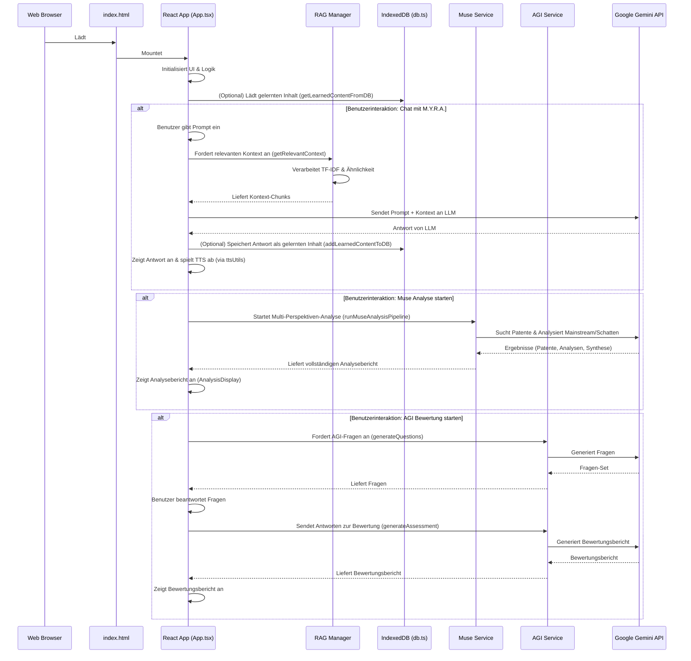

```mermaid
sequenceDiagram
    participant Browser as Web Browser
    participant HTML as index.html
    participant App as React App (App.tsx)
    participant RagManager as RAG Manager
    participant IndexedDB as IndexedDB (db.ts)
    participant MuseService as Muse Service
    participant AGIService as AGI Service
    participant GeminiAPI as Google Gemini API

    Browser->>HTML: Lädt
    HTML->>App: Mountet #root & lädt index.tsx (-> App.tsx)
    App->>App: Initialisiert UI & Logik
    App->>IndexedDB: (Optional) Lädt gelernten Inhalt (getLearnedContentFromDB)

    alt Benutzerinteraktion: Chat mit M.Y.R.A.
        App->>App: Benutzer gibt Prompt ein
        App->>RagManager: Fordert relevanten Kontext an (getRelevantContext)
        RagManager->>RagManager: Verarbeitet TF-IDF & Ähnlichkeit
        RagManager-->>App: Liefert Kontext-Chunks
        App->>GeminiAPI: Sendet Prompt + Kontext an LLM
        GeminiAPI-->>App: Antwort von LLM
        App->>IndexedDB: (Optional) Speichert Antwort als gelernten Inhalt (addLearnedContentToDB)
        App->>App: Zeigt Antwort an & spielt TTS ab (via ttsUtils)
    end

    alt Benutzerinteraktion: Muse Analyse starten
        App->>MuseService: Startet Multi-Perspektiven-Analyse (runMuseAnalysisPipeline)
        MuseService->>GeminiAPI: Sucht Patente & Analysiert Mainstream/Schatten
        GeminiAPI-->>MuseService: Ergebnisse (Patente, Analysen, Synthese)
        MuseService-->>App: Liefert vollständigen Analysebericht
        App->>App: Zeigt Analysebericht an (AnalysisDisplay)
    end

    alt Benutzerinteraktion: AGI Bewertung starten
        App->>AGIService: Fordert AGI-Fragen an (generateQuestions)
        AGIService->>GeminiAPI: Generiert Fragen
        GeminiAPI-->>AGIService: Fragen-Set
        AGIService-->>App: Liefert Fragen
        App->>App: Benutzer beantwortet Fragen
        App->>AGIService: Sendet Antworten zur Bewertung (generateAssessment)
        AGIService->>GeminiAPI: Generiert Bewertungsbericht
        GeminiAPI-->>AGIService: Bewertungsbericht
        AGIService-->>App: Liefert Bewertungsbericht
        App->>App: Zeigt Bewertungsbericht an
    end
```